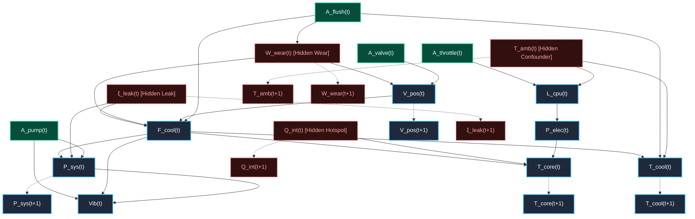

# WORLD SPECIFICATION: ThermoHydro-Compute System (THC-SCM)
**Version:** 1.1.0  
**Domain:** Industrial Cyber-Physical Server Cluster & Thermal-Hydraulic Cooling Loop  
**Purpose:** Ground-Truth Structural Causal Model (SCM), Observation Model, Intervention Semantics, Probabilistic Counterfactual Semantics, and Verification Protocol.

---

## 1. System Being Modeled

The **ThermoHydro-Compute System (THC-SCM)** models a high-density compute server rack coupled with an active closed-loop liquid-to-air heat exchange system.

```
                              [ Ambient Temp (T_amb) ] (Latent Confounder)
                                     /             \
                                    /               \
                                   ▼                 ▼
  [ Compute Workload (L) ] ──────────────► [ Heat Generated (Q_in) ] ◄────── [ Latent Hotspot Flux (Q_internal) ]
            │                                        │
            ▼                                        ▼
    [ Target Workload ] ──────────────► [ Core Temperature (T_core) ] ◄────── [ Latent Wear (W) ]
            │                                        │                                │
            │ (Controller Policy)                    ▼                                │
            └─────────────────────────► [ Coolant Flow Rate (F) ] ◄───────────────────┼── [ Micro-Leak (ξ_leak) ]
                                                     │                                │
                                                     ▼                                │
                                        [ System Pressure (P) ] ◄── [ Pump (A_pump) ] ┘
                                                     │
                                                     ▼
                                        [ Acoustic Vibration (V) ]
```

The system captures:
1. **Dynamic load and thermal dissipation**: Compute execution generates nominal heat which, modulated by latent silicon hotspot flux $Q_{\text{internal}}$, drives core temperature $T_{\text{core}}$.
2. **Convective cooling loop**: Pump speed $A_{\text{pump}}$ and motorized valve position $V_{\text{pos}}$ govern coolant flow $F_{\text{cool}}$ and system pressure $P_{\text{sys}}$, extracting heat $Q_{\text{out}}$.
3. **Hydraulic degradation & leaks**: Latent micro-leak rate $\xi_{\text{leak}}$ and wear $W_{\text{wear}}$ degrade loop pressure, impede flow, and cause actuator lag.
4. **Flushing actuator**: Emergency flush $A_{\text{flush}}$ purges lines, temporarily drops coolant temp, and partially relieves fouling.
5. **Confounding environmental drivers**: Ambient temperature $T_{\text{amb}}$ drives both ambient compute demand and baseline cooling radiator efficiency.
6. **Derived Diagnostic Classifier**: A deterministic safety evaluator $g(\mathbf{X}_t)$ evaluates physical safety boundaries and latches failure events without expanding the 12-dimensional state vector.

---

## 2. State Variables

The physical state of the system at discrete time step $t$ is strictly defined as a 12-dimensional state vector $\mathbf{X}_t \in \mathbb{R}^{12}$, partitioned into 8 observable state variables $\mathbf{Y}_t \in \mathbb{R}^8$ and 4 hidden/latent state variables $\mathbf{Z}_t \in \mathbb{R}^4$.

$$\mathbf{X}_t = [\mathbf{Y}_t^T, \mathbf{Z}_t^T]^T \in \mathbb{R}^{12}$$

| Index | Symbol | Name | Unit | Physical Range | Observability | Description |
|---|---|---|---|---|---|---|
| $0$ | $T_{\text{core}}$ | Core Temperature | $^\circ\text{C}$ | $[20.0, 125.0]$ | **Observable** | Average semiconductor junction temperature |
| $1$ | $T_{\text{cool}}$ | Coolant Outlet Temp | $^\circ\text{C}$ | $[15.0, 95.0]$ | **Observable** | Temperature of coolant exiting heat sink block |
| $2$ | $P_{\text{sys}}$ | Loop Pressure | $\text{bar}$ | $[0.5, 6.0]$ | **Observable** | Total hydrostatic + dynamic hydraulic pressure |
| $3$ | $F_{\text{cool}}$ | Coolant Flow Rate | $\text{L/min}$ | $[0.0, 60.0]$ | **Observable** | Volumetric fluid displacement rate |
| $4$ | $L_{\text{cpu}}$ | Compute Workload | $\%$ | $[0.0, 100.0]$ | **Observable** | Normalized CPU compute utilization load |
| $5$ | $V_{\text{pos}}$ | Coolant Valve Position | $\%$ | $[0.0, 100.0]$ | **Observable** | Actual physical opening percentage of valve |
| $6$ | $\text{Vib}_{\text{pump}}$ | Pump Vibration / Noise | $\text{mm/s}$ | $[0.0, 25.0]$ | **Observable** | High-frequency mechanical chassis vibration |
| $7$ | $P_{\text{elec}}$ | Electrical Power Draw | $\text{kW}$ | $[0.2, 5.0]$ | **Observable** | Rack electrical power consumption |
| $8$ | $T_{\text{amb}}$ | Ambient Temperature | $^\circ\text{C}$ | $[10.0, 45.0]$ | **Hidden / Confounder** | Ambient temperature around facility |
| $9$ | $W_{\text{wear}}$ | Mechanical & Thermal Wear | $[0, 1]$ | $[0.0, 1.0]$ | **Hidden** | Cumulative fouling & actuator friction |
| $10$ | $Q_{\text{internal}}$ | Latent Hotspot Flux | $\text{kW}$ | $[-0.5, 2.5]$ | **Hidden** | Latent thermal gradient / micro-architectural hotspot flux |
| $11$ | $\xi_{\text{leak}}$ | Coolant Micro-Leak Rate | $\text{mL/hr}$ | $[0.0, 50.0]$ | **Hidden** | Latent seal degradation causing fluid pressure loss |

> [!NOTE]
> **Failure Status & Risk (`FailureRisk`, `failed`, `failure_mode`):**  
> Physical failure metrics are strictly **derived outputs** calculated via the evaluation mapping $g(\mathbf{X}_t) \to \{\text{failed}, \text{mode}, \text{risk\_score}\}$. They are **not** state variables and do not expand the 12-dimensional state vector $\mathbf{X}_t$.

---

## 3. Action Space

Actions $\mathbf{A}_t$ represent operator or supervisory controller inputs executed at step $t$:

$$\mathbf{A}_t = [A_{\text{valve}}, A_{\text{throttle}}, A_{\text{pump}}, A_{\text{flush}}]_t^T$$

| Action Variable | Type / Range | Nominal Natural Mechanism | Direct Physical Effect |
|---|---|---|---|
| $A_{\text{valve}}$ | Continuous $[0.0, 100.0]\%$ | Proportional-Integral (PI) feedback on $T_{\text{core}}$ | Sets target setpoint for physical valve position actuator $V_{\text{pos}}$ |
| $A_{\text{throttle}}$ | Continuous $[10.0, 100.0]\%$ | Client job scheduler / auto-scaler | Caps maximum allowable CPU compute utilization $L_{\text{cpu}}$ |
| $A_{\text{pump}}$ | Discrete $\{1, 2, 3, 4\}$ | Discrete pump speed staging (Default: 2) | Dictates mechanical pump head pressure $H_{\text{pump}}$ and base flow capacity |
| $A_{\text{flush}}$ | Binary $\{0, 1\}$ | Emergency operator purge (Default: 0) | Injects cold reservoir fluid, purges line resistance, momentarily surges flow |

---

## 4. Observation Space

Telemetry exposed to learning agents is subject to sensor noise, calibration offset, and discretization:

$$\mathbf{O}_t = h(\mathbf{X}_t) + \mathbf{\epsilon}_{\text{obs}, t} \in \mathbb{R}^8$$

$$\mathbf{O}_t = \begin{bmatrix}
\tilde{T}_{\text{core}} \\
\tilde{T}_{\text{cool}} \\
\tilde{P}_{\text{sys}} \\
\tilde{F}_{\text{cool}} \\
\tilde{L}_{\text{cpu}} \\
\tilde{V}_{\text{pos}} \\
\tilde{\text{Vib}}_{\text{pump}} \\
\tilde{P}_{\text{elec}}
\end{bmatrix}_t = 
\begin{bmatrix}
T_{\text{core}, t} + \epsilon_{T,\text{core}} \\
T_{\text{cool}, t} + \epsilon_{T,\text{cool}} \\
P_{\text{sys}, t} + \epsilon_P \\
F_{\text{cool}, t} + \epsilon_F \\
L_{\text{cpu}, t} + \epsilon_L \\
V_{\text{pos}, t} + \epsilon_V \\
\text{Vib}_{\text{pump}, t} + \epsilon_{\text{vib}} \\
P_{\text{elec}, t} + \epsilon_{\text{elec}}
\end{bmatrix}$$

- **Sensor Noise Distributions:**
  - $\epsilon_{T,\text{core}} \sim \mathcal{N}(0, 0.4^2)$
  - $\epsilon_{T,\text{cool}} \sim \mathcal{N}(0, 0.3^2)$
  - $\epsilon_P \sim \mathcal{N}(0, 0.05^2)$
  - $\epsilon_F \sim \mathcal{N}(0, 0.2^2)$
  - $\epsilon_L \sim \mathcal{N}(0, 0.5^2)$
  - $\epsilon_V \sim \mathcal{N}(0, 0.2^2)$
  - $\epsilon_{\text{vib}} \sim \mathcal{N}(0, 0.15^2)$
  - $\epsilon_{\text{elec}} \sim \mathcal{N}(0, 0.02^2)$

---

## 5. Hidden Variables & Confounding Mechanics

1. **Ambient Temperature $T_{\text{amb}}$ (Confounder):**
   - **Workload Confounding**: Facilities experience higher user traffic during hot daylight hours: $L_{\text{target}} \propto T_{\text{amb}}$.
   - **Cooling Efficiency Confounding**: External heat decreases cooling radiator efficiency: $\Delta T_{\text{rad}} = (T_{\text{cool}} - T_{\text{amb}})$.
   - **Resulting Spurious Association**: Purely observational data sees Workload $\uparrow$, Flow $\uparrow$, Ambient $\uparrow$, causing an observational model to mistake workload for direct pump wear.

2. **Mechanical & Thermal Wear $W_{\text{wear}}$ (Latent Memory):**
   - Accumulates monotonically under elevated temperature: $\Delta W \propto \max(0, T_{\text{core}} - 75.0)$.
   - Causes actuator lag: slows valve response time $\tau_{\text{valve}}(W)$.
   - Degrades thermal interface material: lowers heat transfer coefficient $k_{\text{transfer}}(W)$.

3. **Latent Hotspot Flux $Q_{\text{internal}}$ (Micro-Architectural Heat Gradient):**
   - Represents unobserved non-uniform core silicon activity (e.g. AVX-512 matrix instructions or localized transistor hotspots).
   - Enters as an additive latent correction to nominal heat generation: $Q_{\text{in}} = Q_{\text{nominal}}(P_{\text{elec}}) + Q_{\text{internal}}$.

4. **Coolant Micro-Leak Rate $\xi_{\text{leak}}$ (Latent Hydraulic Fault):**
   - Slowly bleeds loop fluid mass, reducing baseline hydraulic head pressure and introducing cavitation vulnerability.
   - Effective flow: $F_{\text{eff}} = F_{\text{cool}} \cdot \max\left(0, 1 - \frac{\xi_{\text{leak}}}{100}\right)$.

---

## 6. Structural Causal Graph & Temporal Persistence

All 12 state variables follow explicit intra-slice causal arrows and inter-slice ($t \to t+1$) temporal persistence:



---

## 7. Structural Transition Dynamics (Mathematical Equations)

Let the discrete simulation step be $\Delta t = 1.0\text{ sec}$.

### 7.1 Electrical Power Draw ($P_{\text{elec}}$)
$$P_{\text{elec}, t} = P_{\text{idle}} + \beta_L \cdot \left(\frac{L_{\text{cpu}, t}}{100}\right)^{1.25} + U_{P_{\text{elec}}, t}$$
where $P_{\text{idle}} = 0.35\text{ kW}$, $\beta_L = 3.8\text{ kW}$.

### 7.2 Heat Generation ($Q_{\text{in}}$) & Hotspot Flux ($Q_{\text{internal}}$)
The nominal heat generated from compute power plus ambient chassis absorption:
$$Q_{\text{nominal}, t} = \eta_{\text{elec}} \cdot P_{\text{elec}, t} + \alpha_{\text{amb}} \max(0, T_{\text{amb}, t} - 25.0)$$
The actual effective heat generation incorporates the latent hotspot flux $Q_{\text{internal}, t}$:
$$Q_{\text{in}, t} = Q_{\text{nominal}, t} + Q_{\text{internal}, t} + U_{Q, t}$$
where $\eta_{\text{elec}} = 0.92$, $\alpha_{\text{amb}} = 0.015\text{ kW/}^\circ\text{C}$.

Hotspot flux evolves as a bounded autoregressive disturbance:
$$Q_{\text{internal}, t+1} = 0.92 \, Q_{\text{internal}, t} + 0.08 \, \mu_{Q,\text{hotspot}} + U_{Q_{\text{int}}, t}$$

### 7.3 Valve Position Actuator ($V_{\text{pos}}$)
Actuator lag is slowed by wear $W_{\text{wear}}$:
$$\tau_{\text{eff}} = \tau_0 \cdot (1.0 + 1.5 \cdot W_{\text{wear}, t})$$
$$V_{\text{pos}, t+1} = V_{\text{pos}, t} + \frac{\Delta t}{\tau_{\text{eff}}} (A_{\text{valve}, t} - V_{\text{pos}, t}) + U_{V, t}$$
where $\tau_0 = 2.5\text{ sec}$.

### 7.4 Hydraulic Pump Head & Loop Pressure ($P_{\text{sys}}$)
Pump speed setting $A_{\text{pump}} \in \{1, 2, 3, 4\}$ establishes mechanical head pressure $H_{\text{pump}}$:
$$H_{\text{pump}}(A_{\text{pump}}) = P_{\text{base}} \cdot (0.6 + 0.35 \cdot A_{\text{pump}})$$
Loop pressure accounts for pump head, fluid backpressure from flow, and leak depressurization:
$$P_{\text{sys}, t+1} = H_{\text{pump}}(A_{\text{pump}, t}) + k_p \left(\frac{F_{\text{cool}, t}}{F_{\text{max}}}\right)^2 - \delta_{\text{leak}} \left(\frac{\xi_{\text{leak}, t}}{50.0}\right) + U_{P, t}$$
where $P_{\text{base}} = 1.8\text{ bar}$, $k_p = 1.6\text{ bar}$, $\delta_{\text{leak}} = 0.7\text{ bar}$.

### 7.5 Coolant Flow Rate ($F_{\text{cool}}$)
Flow depends on pump head, valve aperture, wear resistance, micro-leaks, and emergency flush action $A_{\text{flush}}$:
$$F_{\text{ideal}} = F_{\text{max}} \cdot \sqrt{\frac{H_{\text{pump}}(A_{\text{pump}, t})}{H_{\text{nominal}}}} \cdot \left(\frac{V_{\text{pos}, t+1}}{100}\right)^{1.35}$$
$$F_{\text{cool}, t+1} = \left[ F_{\text{ideal}} \cdot (1 - 0.35 W_{\text{wear}, t}) \cdot \left(1 - \frac{\xi_{\text{leak}, t}}{100}\right) + \Delta F_{\text{flush}} \cdot A_{\text{flush}, t} \right] + U_{F, t}$$
where $F_{\text{max}} = 55.0\text{ L/min}$, $\Delta F_{\text{flush}} = 12.0\text{ L/min}$.

### 7.6 Acoustic Vibration & Mechanical Stress ($\text{Vib}_{\text{pump}}$)
$$\text{Vib}_{\text{pump}, t+1} = \gamma_0 + \gamma_1 \cdot A_{\text{pump}, t}^{1.4} + \gamma_2 \cdot P_{\text{sys}, t+1}^{1.6} + \gamma_3 \cdot W_{\text{wear}, t} + U_{\text{vib}, t}$$
where $\gamma_0 = 1.0$, $\gamma_1 = 0.8$, $\gamma_2 = 0.9$, $\gamma_3 = 2.2$.

### 7.7 Convective Thermal Dissipation ($Q_{\text{out}}$)
$$k_{\text{eff}}(W) = k_{\text{trans}, 0} \cdot (1 - 0.45 W_{\text{wear}, t})$$
$$\phi(F) = 1.0 - \exp\left(-\frac{F_{\text{cool}, t+1}}{F_{\text{scale}}}\right)$$
$$Q_{\text{out}, t} = k_{\text{eff}}(W) \cdot \phi(F) \cdot (T_{\text{core}, t} - T_{\text{cool}, t})$$
where $k_{\text{trans}, 0} = 0.12\text{ kW/}^\circ\text{C}$, $F_{\text{scale}} = 14.0\text{ L/min}$.

### 7.8 Core Temperature Update ($T_{\text{core}}$)
$$\frac{d T_{\text{core}}}{dt} = \frac{1}{C_{\text{core}}} \left( Q_{\text{in}, t} - Q_{\text{out}, t} - k_{\text{ambient\_loss}} (T_{\text{core}, t} - T_{\text{amb}, t}) \right)$$
$$T_{\text{core}, t+1} = T_{\text{core}, t} + \Delta t \cdot \frac{d T_{\text{core}}}{dt} + U_{T_{\text{core}}, t}$$
where $C_{\text{core}} = 0.085\text{ kJ/}^\circ\text{C}$, $k_{\text{ambient\_loss}} = 0.005\text{ kW/}^\circ\text{C}$.

### 7.9 Coolant Temperature Update ($T_{\text{cool}}$)
Coolant absorbs $Q_{\text{out}}$, rejects heat to ambient radiator, and drops abruptly if $A_{\text{flush}}=1$:
$$Q_{\text{radiator}, t} = k_{\text{rad}} \cdot (T_{\text{cool}, t} - T_{\text{amb}, t})$$
$$T_{\text{cool}, t+1} = T_{\text{cool}, t} + \frac{\Delta t}{C_{\text{loop}}} \left( Q_{\text{out}, t} - Q_{\text{radiator}, t} \right) - \Delta T_{\text{flush}} \cdot A_{\text{flush}, t} + U_{T_{\text{cool}}, t}$$
where $C_{\text{loop}} = 0.45\text{ kJ/}^\circ\text{C}$, $k_{\text{rad}} = 0.065\text{ kW/}^\circ\text{C}$, $\Delta T_{\text{flush}} = 4.5^\circ\text{C}$.

### 7.10 Latent Wear & Micro-Leak Dynamics
$$W_{\text{wear}, t+1} = \min\left(1.0, \, W_{\text{wear}, t} + \lambda_w \max(0, T_{\text{core}, t} - 75.0) \Delta t - \Delta W_{\text{flush}} \cdot A_{\text{flush}, t}\right) + U_{W, t}$$
$$\xi_{\text{leak}, t+1} = \min\left(50.0, \, \xi_{\text{leak}, t} + \lambda_{\text{leak}} \max(0, P_{\text{sys}, t} - 4.2) \Delta t\right) + U_{\xi, t}$$
where $\lambda_w = 0.0001$, $\Delta W_{\text{flush}} = 0.03$, $\lambda_{\text{leak}} = 0.005$.

---

## 8. Random Variables & Exogenous Stochastic Processes

The full exogenous disturbance vector $\mathbf{U}_t \in \mathbb{R}^9$ is defined as:

$$\mathbf{U}_t = [ U_{\text{amb}}, U_{P_{\text{elec}}}, U_Q, U_{Q_{\text{int}}}, U_V, U_P, U_F, U_{\text{vib}}, U_{T_{\text{core}}}, U_{T_{\text{cool}}}, U_W, U_\xi ]_t^T$$

1. **Ambient Disturbance $U_{\text{amb}, t}$ (Ornstein-Uhlenbeck Process):**
   $$T_{\text{amb}, t+1} = T_{\text{amb}, t} + \theta_{\text{amb}}(\mu_{\text{amb}} - T_{\text{amb}, t})\Delta t + \sigma_{\text{amb}}\sqrt{\Delta t} \cdot \zeta_{\text{amb}, t}$$
   where $\theta_{\text{amb}} = 0.02$, $\mu_{\text{amb}} = 27.0^\circ\text{C}$, $\sigma_{\text{amb}} = 0.15$, $\zeta_{\text{amb}, t} \sim \mathcal{N}(0, 1)$.
2. **Process Disturbances (Gaussian Innovations):**
   - $U_{Q, t} \sim \mathcal{N}(0, 0.04^2)$
   - $U_{Q_{\text{int}}, t} \sim \mathcal{N}(0, 0.02^2)$
   - $U_{V, t} \sim \mathcal{N}(0, 0.1^2)$
   - $U_{P, t} \sim \mathcal{N}(0, 0.02^2)$
   - $U_{F, t} \sim \mathcal{N}(0, 0.15^2)$
   - $U_{T_{\text{core}}, t} \sim \mathcal{N}(0, 0.08^2)$
   - $U_{T_{\text{cool}}, t} \sim \mathcal{N}(0, 0.05^2)$
   - $U_{\text{vib}, t} \sim \mathcal{N}(0, 0.08^2)$
3. **Strict Reproducibility Policy**:
   Given initial state $\mathbf{X}_0$, action sequence $\mathbf{A}_{0:T}$, and an integer seed $\mathcal{S}_{\text{seed}}$, the trajectory sequence is 100% bit-for-bit reproducible across runs.

---

## 9. Intervention Semantics ($do$-Calculus)

An intervention $do(X = x^*)$ performs **atomic graph surgery**:
1. All incoming directed edges into $X$ ($PA(X) \to \emptyset$) are severed.
2. The structural equation for $X$ is replaced with the constant assignment $X \leftarrow x^*$.
3. All downstream causal children update according to their natural physical laws evaluated on $X = x^*$.

### Benchmark Interventions:

#### Intervention 1: Valve Position Clamp vs Action Command
- **Natural Action**: $A_{\text{valve}} = 85\%$ (subject to wear lag $\tau_{\text{eff}}(W_{\text{wear}})$).
- **Intervention**: $do(V_{\text{pos}} = 85\%)$ (instantly forces valve aperture, cutting $A_{\text{valve}} \to V_{\text{pos}}$ and $W_{\text{wear}} \to V_{\text{pos}}$).

#### Intervention 2: Workload Curtailment
- **Intervention**: $do(L_{\text{cpu}} = 20\%)$ (cuts ambient confounding $T_{\text{amb}} \to L_{\text{cpu}}$).

#### Intervention 3 (Counter-Intuitive Trade-off): Max Cooling at High Pump
- **Intervention**: $do(V_{\text{pos}} = 100\%)$ with $A_{\text{pump}} = 4$.
- **Downstream effect**: Core temperature $T_{\text{core}}$ drops rapidly, but hydrostatic pressure surges above $5.5\text{ bar}$, triggering a hydraulic overpressure burst failure.

#### Intervention 4 (Anti-Spurious Sanity Check): Vibration Damping
- **Intervention**: $do(\text{Vib}_{\text{pump}} = 0.5\text{ mm/s})$.
- **Causal Effect**: $\frac{\partial T_{\text{core}}}{\partial do(\text{Vib})} \equiv 0$, $\frac{\partial P(\text{Failure})}{\partial do(\text{Vib})} \equiv 0$. Proves model does not mistake acoustic noise for a thermal cause.

---

## 10. Counterfactual Semantics (Probabilistic Abduction & Replay)

Given an observed historical episode $\mathcal{E} = \{(\mathbf{o}_0, \mathbf{a}_0), \dots, (\mathbf{o}_T, \mathbf{a}_T)\}$, we answer:
> *"What would have happened if the operator had taken action $\mathbf{A}'_{t^*}$ at step $t^*$ instead of the recorded action $\mathbf{A}_{t^*}$, holding the episode's unobserved ambient conditions, latent wear, and stochastic disturbances fixed?"*

### Canonical Counterfactual Protocol:
1. **Single Action Modification**: Only the action at step $t^*$ is modified: $\mathbf{A}_{t^*} \leftarrow \mathbf{A}'_{t^*}$.
2. **Fixed Future Actions**: All subsequent recorded actions $\mathbf{A}_{t^*+1:T}$ remain identical to the historical recording.
3. **Probabilistic Abduction**:
   Because latent states ($\mathbf{Z}_t$) and sensor noises ($\mathbf{\epsilon}_t$) prevent deterministic noise recovery, the engine computes the posterior distribution:
   $$P(\mathbf{U}_{0:T}, \mathbf{Z}_{0} \mid \mathbf{O}_{0:T}, \mathbf{A}_{0:T})$$
4. **Monte Carlo Twin-World Replay**:
   Sample $M$ latent trajectories $(\mathbf{U}^{(m)}, \mathbf{Z}_0^{(m)}) \sim P(\mathbf{U}, \mathbf{Z}_0 \mid \mathbf{O}, \mathbf{A})$. For each sample $m \in \{1, \dots, M\}$:
   - For $t < t^*$: $\mathbf{X}_t^{\text{CF}, (m)} = \mathbf{X}_t^{(m)}$ (exact historical trajectory).
   - At $t = t^*$: inject modified action $\mathbf{A}'_{t^*}$.
   - For $t \ge t^*$: propagate through structural equations $f(\mathbf{X}_t, \mathbf{A}_t, \mathbf{U}_t^{(m)})$.
5. **Output**: A calibrated **probability distribution of counterfactual outcomes** (e.g. $P(\text{Failure} \mid \text{do}(A_{t^*}')) = 8.4\%$, $T_{\text{core}, T} = 78.2 \pm 3.1^\circ\text{C}$).

---

## 11. Episode Protocol

- **Duration**: $T = 120\text{ steps}$ ($\Delta t = 1.0\text{s}$, 2-minute episode).
- **Episode Data Structure**:
  ```python
  @dataclass
  class Episode:
      episode_id: str
      seed: int
      timestamps: np.ndarray             # Shape: [120]
      observations: np.ndarray           # Shape: [120, 8] (Observable telemetry + sensor noise)
      actions: np.ndarray                # Shape: [120, 4]
      ground_truth_states: np.ndarray    # Shape: [120, 12] (Complete true latent + state)
      exogenous_noise: np.ndarray        # Shape: [120, 12] (True realized noise vectors U)
      failure_latched: bool              # True if any failure boundary was breached
      failure_mode: Optional[str]        # "thermal_runaway" | "hydraulic_overpressure" | "pump_cavitation"
      failure_timestamp: Optional[int]   # Time step t where failure first occurred
  ```

---

## 12. Ground-Truth Simulator vs World Model Separation

- **Ground Truth Simulator**: Has direct access to the 12-dimensional state vector $\mathbf{X}_t$, latent dynamics $\mathbf{Z}_t$, and analytical differential equations. Used exclusively for generating data, executing twin-world interventions, and benchmark validation.
- **Causal World Model**: Trained **strictly on noisy observations $\mathbf{O}_{0:T}$ and actions $\mathbf{A}_{0:T}$**. It must learn dynamics, infer latent uncertainty, and perform graph-surgical interventions without internal access to simulator code.

---

## 13. Failure Conditions & Execution Latching

The safety classifier $g(\mathbf{X}_t)$ monitors three critical boundaries:

1. **Thermal Runaway Failure:**
   $$T_{\text{core}, t} \ge 105.0^\circ\text{C} \quad \text{for } \ge 3 \text{ consecutive seconds}$$
2. **Hydraulic Overpressure Burst:**
   $$P_{\text{sys}, t} \ge 5.5\text{ bar}$$
3. **Pump Cavitation / Dry Run:**
   $$F_{\text{cool}, t} < 2.0\text{ L/min} \quad \text{while } V_{\text{pos}, t} > 50\% \text{ and } A_{\text{pump}, t} \ge 2$$

> [!IMPORTANT]
> **Failure Latching Semantics:**  
> When a failure boundary is breached at step $t_{\text{fail}}$, **the simulation continues until $T = 120$**, but the state is permanently latched as `failed = True`, with `failure_timestamp = t_fail` and the primary `failure_mode` recorded. This enables full post-mortem trajectory and counterfactual comparison analysis.

---

## 14. Known Assumptions

1. **Causal Sufficiency (Within System Scope)**: All major feedback loops affecting thermal dissipation and hydraulics are captured in the specified DAG.
2. **First-Order Markovian Base State**: Transition probability $P(\mathbf{X}_{t+1} \mid \mathbf{X}_t, \mathbf{A}_t, \mathbf{U}_t)$ depends on state $\mathbf{X}_t$, actions $\mathbf{A}_t$, and innovations $\mathbf{U}_t$.
3. **Continuous Differentiable Physics**: Core thermal equations follow physical conservation laws (Fourier conduction, Newton cooling, Navier-Stokes fluid approximations).

---

## 15. Known Limitations & Unreliable Operating Regions

The world model must explicitly flag **high epistemic uncertainty** and report predictions as unreliable under the following regimes:

1. **Out-of-Distribution (OOD) Regimes**: $T_{\text{core}} > 115^\circ\text{C}$ or $L_{\text{cpu}} > 95\%$ with low historical training density.
2. **Unobserved Confounder Shift**: Facility ambient heat wave ($T_{\text{amb}} > 42^\circ\text{C}$) occurring outside training distribution.
3. **Severe Actuator Stiction / Wear**: $W_{\text{wear}} > 0.85$, causing non-linear valve stiction and hysteresis.
4. **Sensor Telemetry Dropout**: Missing $\tilde{P}_{\text{sys}}$ or $\tilde{F}_{\text{cool}}$ observation streams, requiring posterior variance expansion.
