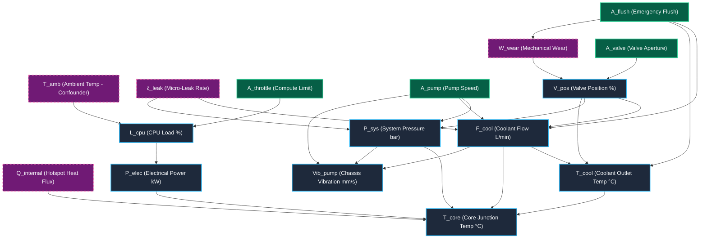

# PRISM Causal Graph Topology

This document details the Structural Causal Model (SCM) DAG for the ThermoHydro-Compute cyber-physical cooling system.

---

## 1. ASCII Causal DAG

```text
T_amb ───────► L_cpu ─────► P_elec ─────► T_core
  │
  └──────────────────────────────────────► cooling context

A_throttle ─► L_cpu

A_valve ────► V_pos ──────► F_cool ─────► T_core
                 ▲             │
                 │             ├────────► P_sys
                 │             └────────► T_cool
                 │
W_wear ──────────┘

A_pump ─────────► P_sys
      └─────────► F_cool

A_flush ────────► F_cool
      └─────────► T_cool / W_wear

Q_internal ─────────────────────────────► T_core

xi_leak ───────► F_cool / P_sys

P_sys ─────────► T_core
P_sys/F_cool/A_pump ─► Vib_pump
```

---

## 2. Mermaid Structural Causal Model (DAG)


