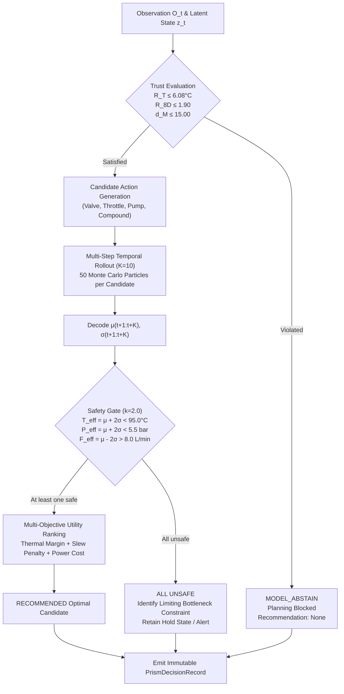

# PRISM Decision & Gating Flow Diagram

This document details the control flow, trust triage, candidate rollout, and safety constraint arbitration logic within PRISM.

---

## 1. ASCII Decision & Gating Flow

```text
                     CURRENT TELEMETRY (O_t, z_t)
                                  │
                                  ▼
                     ┌──────────────────────────┐
                     │   UPSTREAM TRUST GATE    │
                     │  • R_T ≤ 6.08°C          │
                     │  • R_8D ≤ 1.90           │
                     │  • D_latent ≤ 15.00 d_M  │
                     └─────────────┬────────────┘
                                   │
                  ┌────────────────┴────────────────┐
                  ▼                                 ▼
         [Any Check Violated]              [All Checks Passed]
                  │                                 │
                  ▼                                 ▼
       ┌─────────────────────┐           ┌─────────────────────┐
       │    MODEL_ABSTAIN    │           │    MODEL_TRUSTED    │
       │  • Fail-Closed Gate │           │  • Generate Actions │
       │  • Planning Blocked │           │  • Multi-step K=10  │
       │  • Rec = None       │           │  • MC Particles N=50│
       └──────────┬──────────┘           └──────────┬──────────┘
                  │                                 │
                  │                                 ▼
                  │                      ┌─────────────────────┐
                  │                      │ HARD SAFETY GATING  │
                  │                      │   (k = 2.0 Sigma)   │
                  │                      │ T_eff < 95.0°C      │
                  │                      │ P_eff < 5.5 bar     │
                  │                      │ F_eff > 8.0 L/min   │
                  │                      └──────────┬──────────┘
                  │                                 │
                  │               ┌─────────────────┴─────────────────┐
                  │               ▼                                   ▼
                  │      [Any Candidate Safe?]              [All Candidates Unsafe]
                  │               │                                   │
                  │               ▼                                   ▼
                  │    ┌─────────────────────┐             ┌─────────────────────┐
                  │    │ MULTI-OBJ UTILITY   │             │   CANDIDATE REJECT  │
                  │    │ Maximize U(a)       │             │ Find Limiting Viol. │
                  │    │ Select Optimal Action             │ Alert Operator      │
                  │    └──────────┬──────────┘             └──────────┬──────────┘
                  │               │                                   │
                  └───────────────┼───────────────────────────────────┘
                                  ▼
                     ┌──────────────────────────┐
                     │  EMIT DECISION & AUDIT   │
                     └──────────────────────────┘
```

---

## 2. Mermaid Decision Flow


