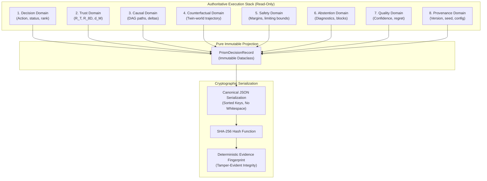

# PRISM Evidence Assembly Flow Diagram

This document details the aggregation, canonical serialization, and cryptographic fingerprinting of the 8-domain PRISM evidence stack.

---

## 1. ASCII Evidence Flow

```text
  ┌────────────────────────────────────────────────────────────────────────┐
  │                 AUTHORITATIVE ENGINE SUBSYSTEM OUTPUTS                 │
  │                                                                        │
  │  [Planner] ──────► 1. Decision Domain (Action, ranking, utility)       │
  │  [Trust Gate] ───► 2. Trust Domain (R_T, R_8D, D_latent, status)       │
  │  [Causal DAG] ───► 3. Causal Reasoning Domain (Paths, direct effects)  │
  │  [CF Engine] ────► 4. Counterfactual Domain (Twin-world replay, deltas)│
  │  [Safety Gate] ──► 5. Safety Domain (Conservative margins, limits)     │
  │  [Abstention] ───► 6. Abstention Domain (Root cause, blocked actions)  │
  │  [Cost Model] ───► 7. Decision Quality (Confidence, regret estimates)  │
  │  [Environment] ──► 8. Provenance Domain (Version, commit, seed, config)│
  └───────────────────────────────────┬────────────────────────────────────┘
                                      │
                                      ▼
  ┌────────────────────────────────────────────────────────────────────────┐
  │                    PURE IMMUTABLE PROJECTION LAYER                     │
  │  • Zero reasoning / Zero calculation duplication                       │
  │  • Compiles structured PrismDecisionRecord dataclass                   │
  └───────────────────────────────────┬────────────────────────────────────┘
                                      │
                                      ▼
  ┌────────────────────────────────────────────────────────────────────────┐
  │                      CANONICAL JSON SERIALIZATION                      │
  │  • Alphabetically sorted keys                                          │
  │  • Whitespace-invariant byte stream                                    │
  └───────────────────────────────────┬────────────────────────────────────┘
                                      │
                                      ▼
  ┌────────────────────────────────────────────────────────────────────────┐
  │                       SHA-256 CRYPTOGRAPHIC HASH                       │
  │  • 256-bit tamper-evident fingerprint                                  │
  │  • Modifying any evidence value changes the output hash                │
  └────────────────────────────────────────────────────────────────────────┘
```

---

## 2. Mermaid Evidence Flow


