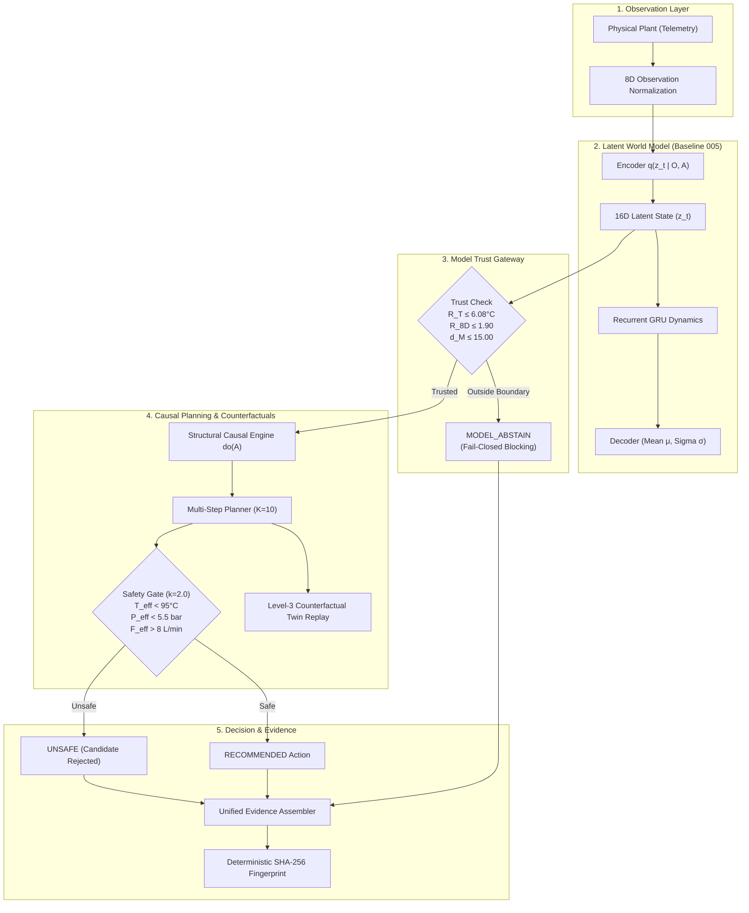

# PRISM System Architecture Diagram

This document contains both ASCII and Mermaid representations of the complete end-to-end PRISM system architecture.

---

## 1. ASCII System Architecture

```text
                                INDUSTRIAL WORLD
                   (High-Density Server & Liquid Cooling Loop)
                                       │
                                       ▼
                       ┌───────────────────────────────┐
                       │      TELEMETRY INGESTION      │
                       │    8D Observations (O_t)      │
                       │      Z-Score Normalizer       │
                       └───────────────┬───────────────┘
                                       │
                                       ▼
                       ┌───────────────────────────────┐
                       │       PRISM WORLD MODEL       │
                       │   16D Latent State Space (z)  │
                       │   Recurrent GRU Dynamics      │
                       │   Decoders (Mean μ, Sigma σ)  │
                       └───────────────┬───────────────┘
                                       │
                 ┌─────────────────────┴─────────────────────┐
                 │                                           │
                 ▼                                           ▼
  ┌─────────────────────────────┐             ┌─────────────────────────────┐
  │     TRUST GATEWAY           │             │     PREDICTIVE FORECASTS    │
  │  • R_T ≤ 6.08°C (Thermal)   │             │  • Multi-horizon H=1..40    │
  │  • R_8D ≤ 1.90 (8D Norm)    │             │  • Heteroscedastic Sigma σ  │
  │  • D_latent ≤ 15.00 d_M     │             │  • Monte Carlo Particles    │
  └──────────────┬──────────────┘             └──────────────┬──────────────┘
                 │                                           │
        [Outside Trust Boundary]                             │
                 ├──► [MODEL_ABSTAIN] ──► (Fail-Closed)     │
                 │                                           │
         [Inside Trust]                                      │
                 │                                           │
                 └─────────────────────┬─────────────────────┘
                                       │
                                       ▼
                       ┌───────────────────────────────┐
                       │   CAUSAL INTERVENTION LAYER   │
                       │    Pearl Structural SCM       │
                       │    Action Surgery do(A=a)     │
                       └───────────────┬───────────────┘
                                       │
                                       ▼
                       ┌───────────────────────────────┐
                       │       DECISION PLANNER        │
                       │   Candidate Generation        │
                       │   Temporal Rollout (K=10)     │
                       │   Multi-Objective Utility     │
                       └───────────────┬───────────────┘
                                       │
                 ┌─────────────────────┴─────────────────────┐
                 │                                           │
                 ▼                                           ▼
  ┌─────────────────────────────┐             ┌─────────────────────────────┐
  │   LEVEL-3 COUNTERFACTUAL    │             │  CONSERVATIVE SAFETY GATE   │
  │  • Exogenous Noise Abduct.  │             │  • T_eff = μ + 2σ < 95.0°C  │
  │  • Action Replacement       │             │  • P_eff = μ + 2σ < 5.5 bar │
  │  • Twin-World Replay        │             │  • F_eff = μ - 2σ > 8.0 L/m │
  └──────────────┬──────────────┘             └──────────────┬──────────────┘
                 │                                           │
                 └─────────────────────┬─────────────────────┘
                                       │
                                       ▼
                       ┌───────────────────────────────┐
                       │    UNIFIED DECISION RECORD    │
                       │    8-Domain Evidence Stack    │
                       │    Deterministic SHA-256      │
                       └───────────────────────────────┘
```

---

## 2. Mermaid System Architecture


